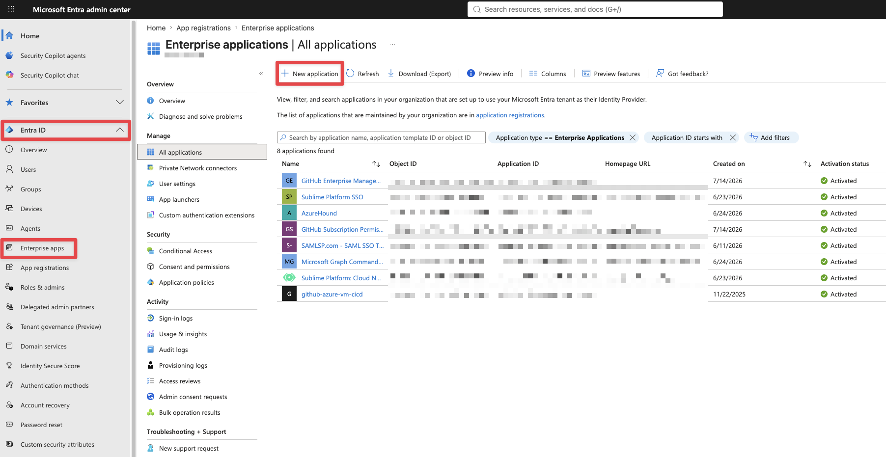
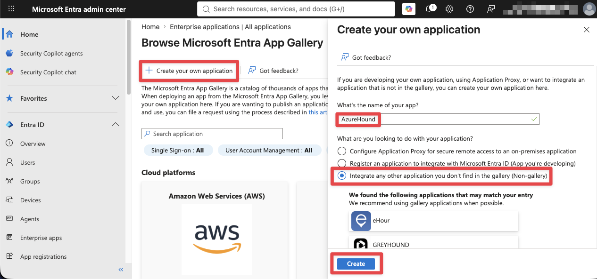
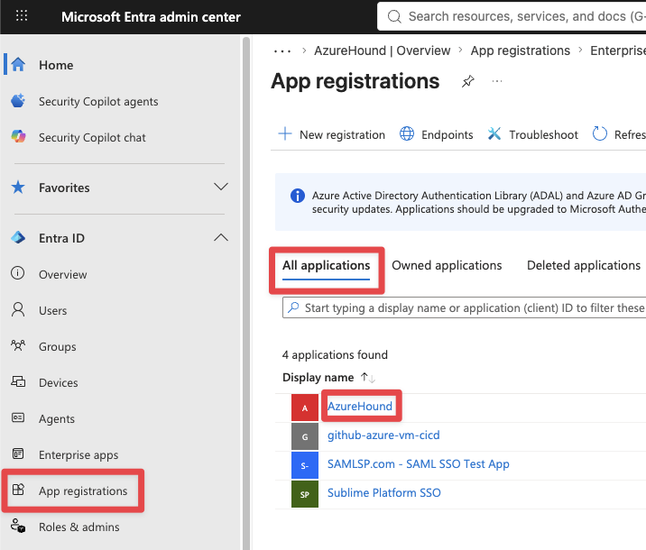
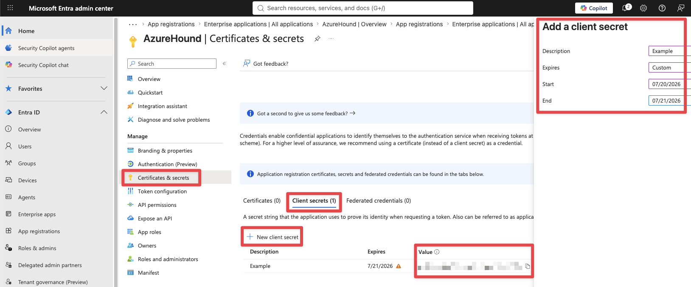
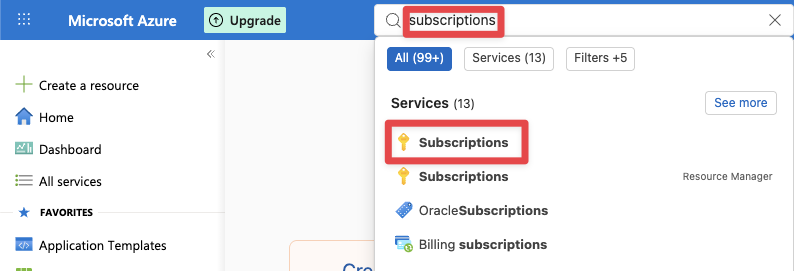
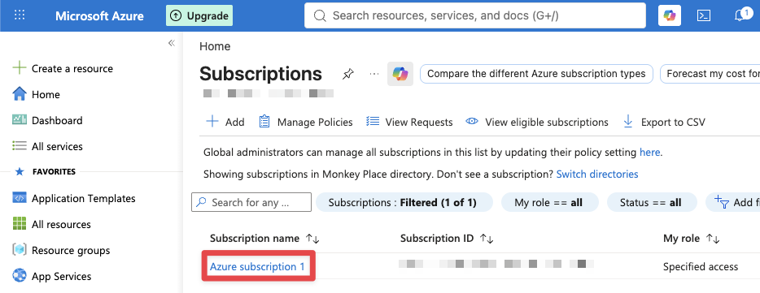
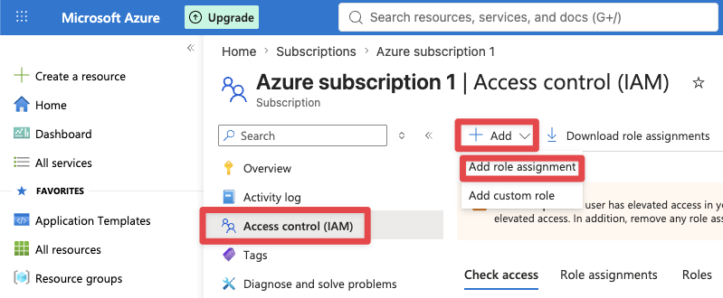
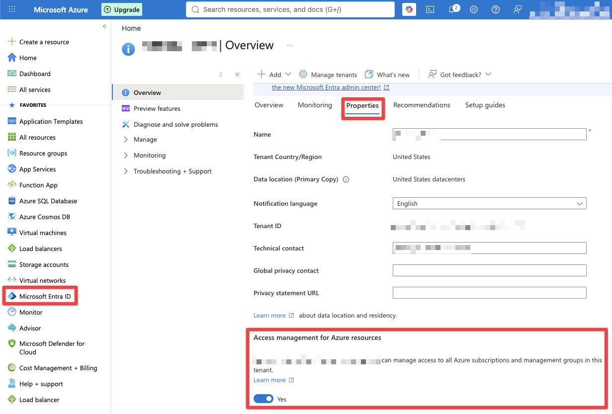
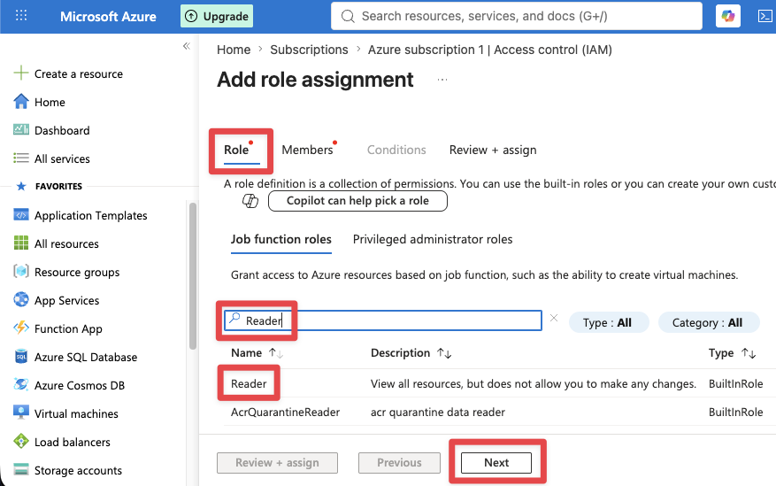
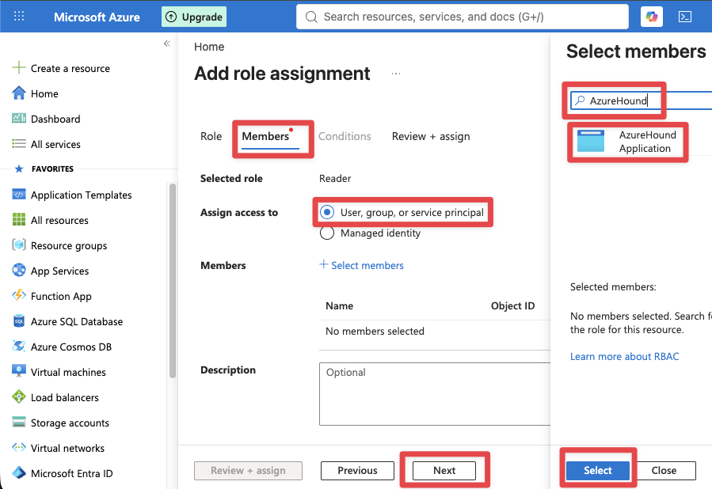

# AzureHound Collection Cheatsheet

## Method 1: Service Account / Service Principal
This method utilizes a dedicated Enterprise Application in Entra ID to execute the data collection. This is the recommended approach for production environments due to two key operational advantages:
1. Credential Lifecycle Management: You can seamlessly generate and immediately revoke a temporary client secret for each specific collection run.
2. Enhanced Auditability: Utilizing a named application makes it easy to identify and attribute Microsoft Graph API usage directly to AzureHound within your security logs.

Step 1: Create a new Enterprise app in Microsoft Entra ID.
1. Go to entra.microsoft.com (Steps 1-4 are in Entra)
2. Entra ID -> Enterprise Apps -> New Application



Step 2: Create and name your new app (e.g., AzureHound).
1. Create your own application -> Integrate any other application you don't find in the gallery (Non-gallery) -> Create



Step 3: Select your new Enterprise app.
1. App registrations -> All applications -> AzureHound



Step 4: Create client secret for Enterprise app.
1. Certificates & secrets -> Client secrets -> New client secret
2. Expires = Custom -> Start = Today -> End = Tomorrow -> Add
3. Copy "Value" to notes, its a required command line argument to run AzureHound later.



Step 5: Search "subscriptions" in Azure.
1. Go to portal.azure.com (The rest of the steps are on Azure)
2. Search "subscriptions" -> select "Subscriptions"



Step 6: Select your Azure subscription.



Step 7: Add role assignment for Enterprise app.
1. Access control (IAM) -> Add -> Add role assignment



Conditional Step: If "Add role assignment" appears as "disabled" in previous step, but are a global admin in Entra.
1. Microsoft Entra ID -> Properties -> Access management for Azure resources = Yes -> Save
2. Sign out and back in



Step 8: Select "Reader" role assignment.
1. Select Role -> Search "Reader" -> Select Reader -> Next



Step 9: Add "Reader" role assignment to Enterprise app.
1. Select Members -> User, group, or service principal -> Select Members -> Search "AzureHound" -> Select "AzureHound" -> Select -> Review + assign



Step 10: Run AzureHound
1. Download latest release from [AzureHound](https://github.com/SpecterOps/AzureHound/releases/tag/v2.12.2).
2. Note required command line arguments Tenant ID, Application ID, & Secret Value.

```
./azurehound list -t "<tenant_id>" -a "<app_id>" -s "<secret_value>" -o "azurehound_output.json"
```

## Method 2: Refresh Token (To-Do)